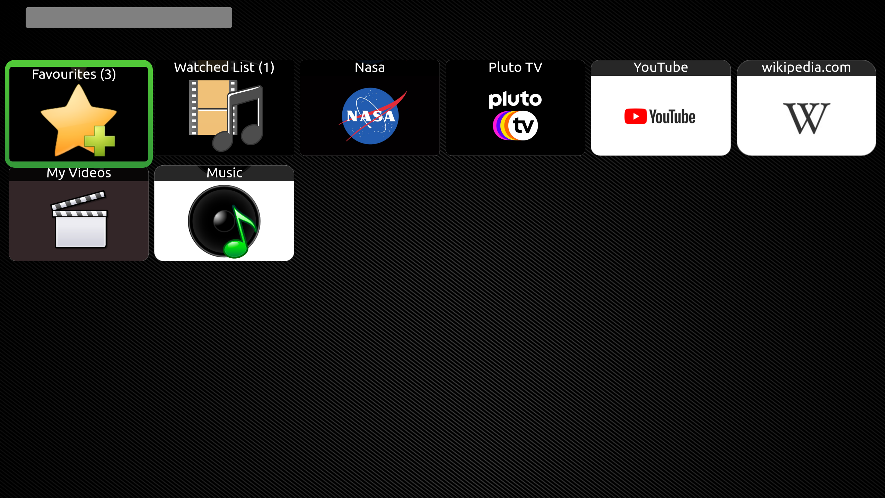
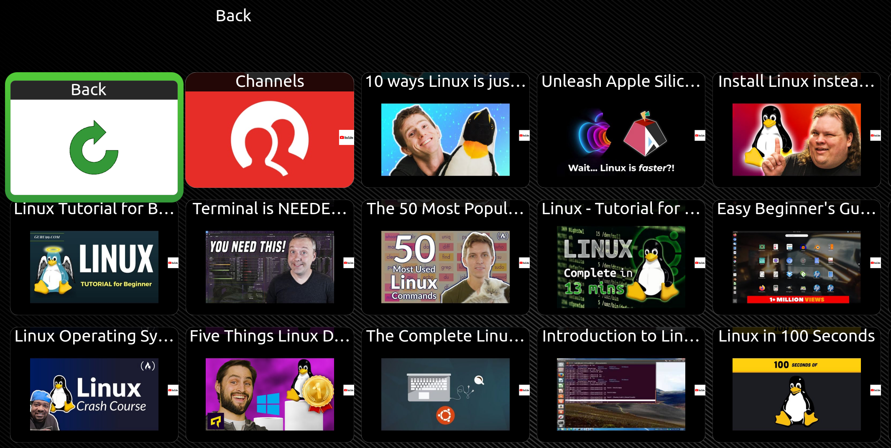

# WHAT IS MYTHAPPS? #
MythApps is a wrapper that gives the illusion of Kodi plugins running natively from MythTV. Apps will comply with the Mythtv theming and remote commands. 
Kodi has a JSON API that allows remote control and to query the GUI. MythApps interprets this into its own GUI. Videos are played in the Kodi video player with some skinning tricks to make it feel like a native application. 

# SCREENSHOTS

# FEATURES
Supports 4K \
Kodi has a very large library of Apps. \
Consistent inferface and MythTV theming. \
Global search on home screen or specifc search when in a directory. \
Play local media not on the mythtv backend.
 
# HOW TO INSTALL
## Compile MythTV and MythPlugins (Linux)

Follow how to compile a plugin: https://www.mythtv.org/wiki/Building_Plugins:HelloMyth

Open terminal and navigate to the mythtv source folder.  \
cd mythtv/mythplugins\
git clone https://github.com/arobro/mythapps/ \
qmake\
sudo make install

You may need to copy the theme files from mythtv/mythplugins/mythapps/theme/default to /usr/local/share/mythtv/themes/default \
Edit mainmenu.xml and add in the below code: gedit /usr/local/share/mythtv/themes/defaultmenu/mainmenu.xml 

\<button\> \
<\type\>MENU_MythApps\</type\> \
\<text>Myth Apps</text\> \
\<action\>PLUGIN mythapps\</action\> \
\</button\>

### Android
1. Use prebuilt mythtv apk with MythApps or compile mythtv with the MythApps plugins.
2. You will need to install an additional apk called MythApp Services.

Compile: https://www.mythtv.org/wiki/MythTV_on_Android and make sure to use https://github.com/MythTV/packaging.git

Apply android.patch under the MythApps directory.
Under the MythPlugins directory, add  SUBDIRS += mythapps to packaging/android/build/mythplugins/config.pro

#### MythApp Services
You can compile using Android Studio or a prebuild MythApp Services apk.  
MythApp Services apk - mythapps/MythAppsServices/app/build/intermediates/apk/debug/app-debug.apk

### Windows
Cross Compile MythTV for Windows via the w64-mingw32MythBuild_MXE.sh build script.  
Run ./"mythtv/platform/win32/w64-mingw32MythBuild_MXE.sh"

cd mythtv/mythplugins/mythapps \
sudo su \
export PATH=/home/ubuntu/Desktop/build/mxe/usr/bin:$PATH  \
export iPre="/home/ubuntu/Desktop/build/install"  \
export qt5="/home/ubuntu/Desktop/build/mxe/usr/i686-w64-mingw32.shared/qt5"

If compiling, you may need to open 'build/mythtv/mythplugins/mythapps/mythapps/makefile' and replace 'qmake' with 'i686-w64-mingw32.shared-qmake-qt5'

# SETUP 
Recommended to use the offical Kodi Repo as it has DRM support - https://kodi.wiki/view/Official_Ubuntu_PPA.
1. DRM - inputstream adaptive is required for 4k video and most popular streaming services. (subscription required)
  Recommended packages: kodi-inputstream-adaptive, kodi-visualization-projectm.   
sudo add-apt-repository ppa:team-xbmc/ppa; sudo apt-get update \
sudo apt-get install kodi kodi-inputstream-adaptive kodi-visualization-projectm netcat-openbsd kodi-eventclients-kodi-send chromium-browser xdotool vnstat

2. Open Kodi. Enabled remote control via http in Kodi->Setting->Services->Control.     Allow Remote Control via HTTP - Yes. \
                   Require Aurthenitcation - Yes. Username / Password / Port (8080) \
                   Allow remote control from applications on this system - Yes 
				          
3. Kodi->Setting->System->Display.      Delay after change of refresh rate - 0.2 seconds \
  .  .  .  .Kodi->Setting->System->Audio->Play Gui Sounds - No \
  .  .  .  .Kodi->Setting->System->Addons->Set Unknown Sources (if required)
				   			   
4. Install some Kodi video addons such as the free Nasa TV in the Kodi gui and check the video plays without prompts in Kodi.

5. Optionally install and open the YouTube addon in Kodi, and sign up for an API key. Enter this in the MythApps setting menu instead of Kodi and click save. - https://www.linuxbabe.com/raspberry-pi/kodi-youtube  
Open the addon in Kodi and navigate to:		YouTube settings->MPEG-DASH->MPEG-DASH - Yes
											YouTube settings->MPEG-DASH->Video quality adaptive (WEBM/VP9) - (to enable 4k)
											YouTube settings->Folders->Quick Search (Incognito)

6. Setup Searching. Each App has a search url and is auto-discovered in the settings menu after opening each App once from MythApps home screen. Some search url's may need to be disabled.

TIPS	 
Tested on mythbuntu skin.  
If you search in the home screen, this will search all apps. Recommended to open the App and then search to get search results just from one App. 
F2 will toggle fullscreen.  
F3 will temporarily stop Kodi from auto minimizing. 		

# DEVELOPER
While MythApps is stable for me, Please note this is a new plugin under developement.

## Code Formating
clang-format -i *.cpp -style="{IndentWidth: 4, ColumnLimit: 200}"  
clang-format -i *.h -style="{IndentWidth: 4, ColumnLimit: 200}"  
clang-format -i *.pl -style="{IndentWidth: 4, ColumnLimit: 200}"  
xmlindent -l 10000 -nba -t -w mythapps-ui.xml 

## Generate developer documenation
doxygen  
 
Get lines of code summary. find . -name '*.cpp' | xargs wc -l  
mythpluginLoader - This allows you to run MythApps as a standalone application.  
MythAppsServices - Switches between Kodi and MythTV on Android via a Java web sockets interface.

## generateThemes.pl
Please only edit mythapps-ui.xml and then run "perl ./generateThemes.pl" after making any changes unless you want to fork the default theme.
This will generate the changes across all themes to help increase maintainability.

## Patches
If submitting a patch and need a fix for a specific app, please use feature detection or alternatively a settings that can be enabled/disabled to fix a bug in a specific app.
Please note, MythApps is a wrapper of the Kodi JSON user interface and with the exception of the Wikipedia search suggestions, does not communicate with any external internet services or APIs.
The media is opened and decoded in an external video player.

Please report any bugs on this Github page and pull requests are welcome.
